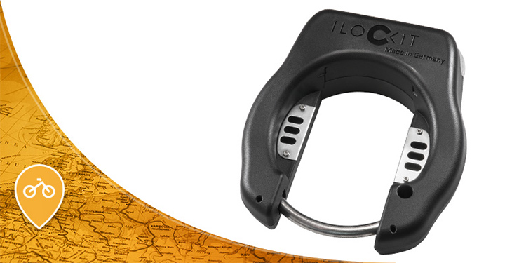

# Elektronisches Fahrradschloss

Die Nutzer sollen zum Absichern der Fahrräder elektronische Schlösser über die App bedienen können. Als durch die App unterstütztes Schloss wurde das link:https://ilockit.bike/Produkt/ilockit-gps/[I LOCK IT der haveltec GmbH] ausgewählt. 

Dieses Schloss verwendet Bluetooth Low Energy für die Kommunikation, das Smartphone muss also zum Öffnen in der Nähe des Schlosses sein. Von haveltec wird außerdem eine Dokumentation für das Schloss bereitgestellt, welche erklärt, welche Entwicklungsschritte für die Steuerung des Schlosses mit einer App notwendig sind.