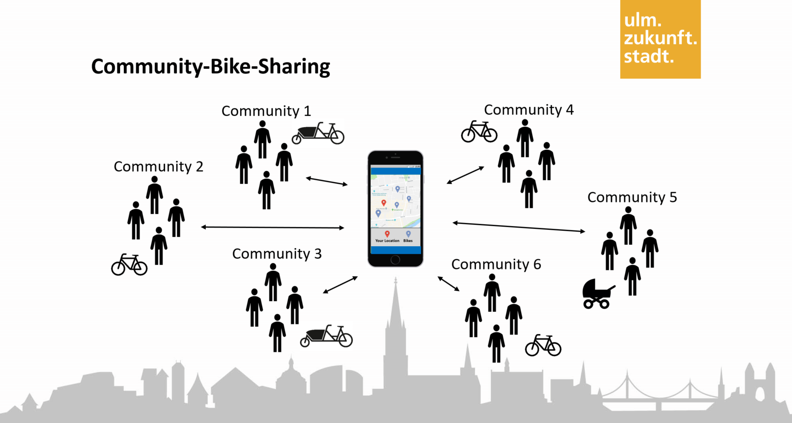
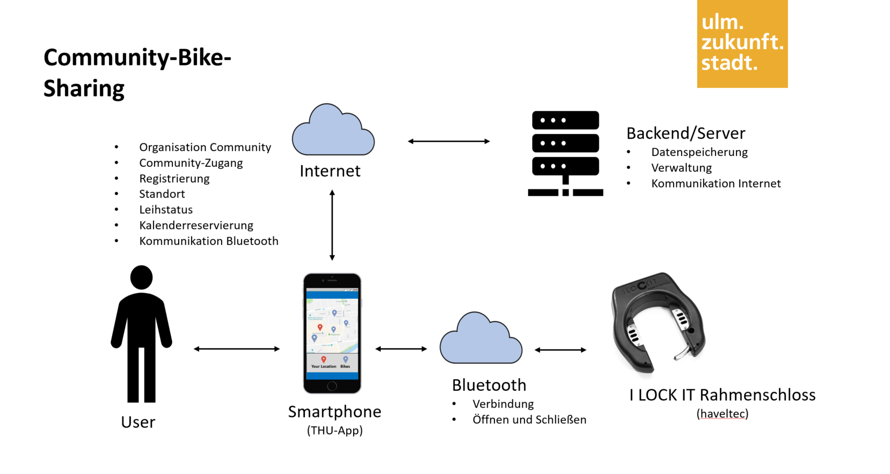

# Community-Bike-Sharing

Im Rahmen des Projekts _Zukunftsstadt Ulm_ soll ein Netz aus flexibel aufstellbarer, eigenständiger und sichtbarer Sensorik zur Erhebung von Mobilitätsdaten aufgebaut werden. In Zusammenarbeit mit den Bürger:Innen soll dadurch ein Impuls für eine zukünftige Infrastruktur zur Datenerhebung geschaffen werden. Die von den Sensoren erfassten und anonymisierten Mobilitätsdaten sollen am Ende über die Datenplattform der Stadt Ulm für eine nachhaltige und agile Stadtplanung weiteren Nutzern zur Verfügung stehen. Die Technische Hochschule Ulm (THU) setzt das Projekt als Kooperationspartner im Themenfeld Mobilität wissenschaftlich um.

Ein weiteres Ziel von _Zukunftsstadt_ ist die Erweiterung von Mobilitätsangeboten in Ulm für die gesamte Bürgerschaft. Bereits heute gibt es viele Gruppen, die erfolgreich gemeinsam Fahrräder nutzen. Das kann das Dienstrad einer Abteilung sein oder eine Hausgemeinschaft die gemeinsam ein Lastenrad besitzen. Werkzeuge, um dies zu intensivieren (mehr Gruppen, mehr gefahrene Kilometer) und damit zur Nachhaltigkeit beizutragen indem Verkehre vom Auto auf das Fahrrad verlagert werden, existieren bisher noch nicht. Hier setzt das *Community-Bike-Sharing (CBS)* mit folgender Grundannahme an: 

Eine Organisation die Fahrräder innerhalb ihrer Gruppe teilt, kann mit den gleichen eingesetzten finanziellen Mitteln einen größeren Effekt für die Nachhaltigkeit erzielen als mit der Einführung eines offenen Bike Sharings. In vielen Fällen tragen die Gruppe die Kosten für die Fahrräder und/oder übernehmen den Aufwand für deren Unterhaltung. Insbesondere sorgt auch das soziale Regulativ durch die Gruppe für einen besseren Umgang mit den Rädern und damit für geringere Kosten. Die Gruppe kann auch als Team oder im direkten Vergleich der Mitglieder den größeren Ansporn für die Nutzung erzeugen. Darüber hinaus können die Gruppen spezielle Räder einsetzen, die ihren Anforderungen entsprechen (eBike, Lastenrad etc). Mögliche Organisationen, die sich eines CBS bedienen können sind Unternehmen die, um ihre Umweltziele zu erfüllen, die Nutzung der Abteilungsräder intensivieren wollen. Kommunen (Städte, Kreise) ebenso wie lokale bürgerschaftliche Initiativen können das Angebot für alle Nutzergruppen öffnen. Damit verbunden ist es im lokalen Kontext auch interessant Bewegungsdaten zu sammeln, die für die Radwegeplanung genutzt werden können.

Für die Entwicklung des CBS wird ein eigenständiges Sharing-System bestehend aus Software (Backend, App) und Hardware (Elektronisches Fahrradschloss) entwickelt. Die Übersicht des Systems mit der Funktion der einzelnen Teilsysteme ist im folgenden Bild dargestellt.

Unabhängig davon sollen außerdem die anonymisierten Bewegungsdaten der Fahrräder mittels LoRa-fähigem GPS-Tracker gesammelt werden.

Dieses Repository soll eine transparente technische Dokumentation bieten. [red]#*ACHTUNG:  Alle, die diesen Prototypen nachbauen, sind als Hersteller selbst verantwortlich. Bei Inverkehrbringung muss sicher gestellt werden, dass alle geltenden EU-Richtlinien eingehalten werden und eine CE-Kennzeichnung angebracht wird. Die THU haftet nicht für die Herstellung und Inverkehrbringung anderer.*#